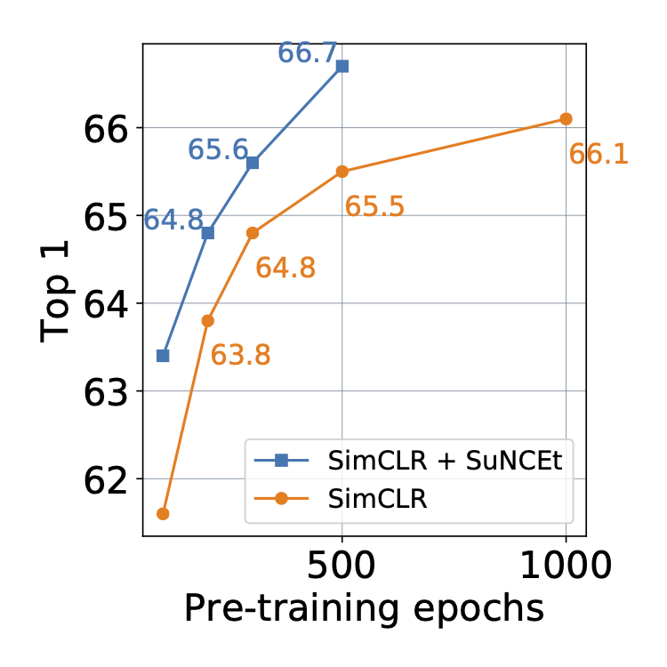

# Supervision Accelerates Pretraining in Contrastive Semi-Supervised Learning of Visual Representations

This code provides PyTorch implementations for both SimCLR and SuNCEt (Supervised Noise Contrastive Estimation), as described in the paper [Supervision Accelerates Pretraining in Contrastive Semi-Supervised Learning of Visual Representations](https://arxiv.org/abs/2006.10803).

SuNCEt is a supervised contrastive loss that is directly *added* to the SimCLR loss *during* pre-training. The idea is to use the available labels during pre-training, not only during network fine-tuning. With 10\% ImageNet labels, SimCLR+SuNCEt can match the best semi-supervised SimCLR pretrain+fine-tune accuracy with less than *half* the amount of pre-training, and all while using the default SimCLR hyper-parameters.
<div class="row">
  
</div>

## Models
| method | epochs | label frac. (%) | batch-size | ImageNet top-1 acc. | args |
|-------------------|-------------------|---------------------|--------------------|--------------------|--------------------|
| SimCLR | 1000 | 10% |  4096 | 66.1 | [script](./configs/train_simclr_imgnt_u90_tr1000.yaml) |
| SimCLR | 500 | 10% | 4096 | 65.5 | [script](./configs/train_simclr_imgnt_u90_tr500.yaml) |
| SimCLR | 300 | 10% | 4096 | 64.8 | [script](./configs/train_simclr_imgnt_u90_tr300.yaml) |
| SimCLR | 200 | 10% | 4096 | 63.8 | [script](./configs/train_simclr_imgnt_u90_tr200.yaml) |
| SimCLR | 100 | 10% | 4096 | 61.7 | [script](./configs/train_simclr_imgnt_u90_tr100.yaml) |


| method | epochs | label frac. (%) | batch-size | ImageNet top-1 acc. | args |
|-------------------|-------------------|---------------------|--------------------|--------------------|--------------------|
| SimCLR+SuNCEt | 500 | 10% | 4096 | 66.7 | [script](./configs/train_suncet_imgnt_u90_tr500.yaml) |
| SimCLR+SuNCEt | 300 | 10% | 4096 | 65.6 | [script](./configs/train_suncet_imgnt_u90_tr300.yaml) |
| SimCLR+SuNCEt | 200 | 10% | 4096 | 64.8 | [script](./configs/train_suncet_imgnt_u90_tr200.yaml) |
| SimCLR+SuNCEt | 100 | 10% | 4096 | 63.2 | [script](./configs/train_suncet_imgnt_u90_tr100.yaml) |


#### Config files
All experiment parameters are specified in config files (as opposed to command-line-arguments). Config files make it easier to keep track of different experiments, as well as launch batches of jobs at a time. The only difference between SimCLR and SimCLR+SuNCEt is that SimCLR doesn't use labels during pre-training. Therefore, to run vanilla SimCLR, it is sufficient to set `supervised_batch_size: 0` in your config file. See the [configs/](configs/) directory for example config files.

## Single-device training

### Pre-training
To launch SimCLR+SuNCEt pretraining on a single machine, simply call
```
python main.py --sel train --fname configs/train_suncet_imgnt_u90_tr100.yaml
```

### Fine-tuning
```
python main.py --sel fine_tune --fname configs/fine_tune_suncet_imgnt_tr100.yaml
```

## Distributed training
We also provide exmaple scripts for launching distributed multi-node runs on a slurm cluster using the open-source [submitit](https://github.com/facebookincubator/submitit) tool.

### Pre-training
To launch a distributed multi-node run you'll need to pass in some additional arguments for *submitit*
```
python main_distributed.py --sel train --fname configs/suncet/train_suncet_imgnt_u90_tr100.yaml --partition $slurm_partition --nodes 8 --tasks-per-node 8 --time 1000 --device volta16gb
```
##### Batch launching
We also provide the option to batch-launch several jobs at once; just specify the names of the config files you would like to launch in another yaml file, and add the `--batch-launch` flag when launching the job
```
python main_distributed.py --sel train --fname configs/batch_train.yaml --batch-launch --partition $slurm_partition --nodes 8 --tasks-per-node 8 --time 1000 --device volta16gb
```

### Fine-tuning
Launching fine-tuning jobs is an identical process, you just need to change `--sel` to `fine_tune` and pass in the appropriate config file.
```
python main_distributed.py --sel fine_tune --fname configs/fine_tune_suncet_imgnt_tr100.yaml --partition $slurm_partition --nodes 8 --tasks-per-node 8 --time 1000 --device volta16gb
```
##### Batch launching
We also provide the option to batch-launch several jobs at once; just specify the names of the config files you would like to launch in another yaml file, and add the `--batch-launch` flag when launching the job
```
python main_distributed.py --sel fine_tune --fname configs/batch_fine_tune.yaml --batch-launch --partition $slurm_partition --nodes 8 --tasks-per-node 8 --time 1000 --device volta16gb
```

## Requirements
* Python 3.6
* PyTorch install 1.4.0
* torchvision
* CUDA 10.1
* Apex with CUDA extension
* Other dependencies: PyYaml, numpy

## License
See the [LICENSE](./LICENSE) file for details about the license under which this code is made available.

## Citation
If you find this repository useful in your research, please cite:
```
@article{assran2020supervision,
  title={Supervision Accelerates Pretraining in Contrastive Semi-Supervised Learning of Visual Representations},
  author={Assran, Mahmoud, and Ballas, Nicolas, and Castrejon, Lluis, and Rabbat, Michael},
  journal={arXiv preprint arXiv:2006.10803},
  year={2020}
}
```
